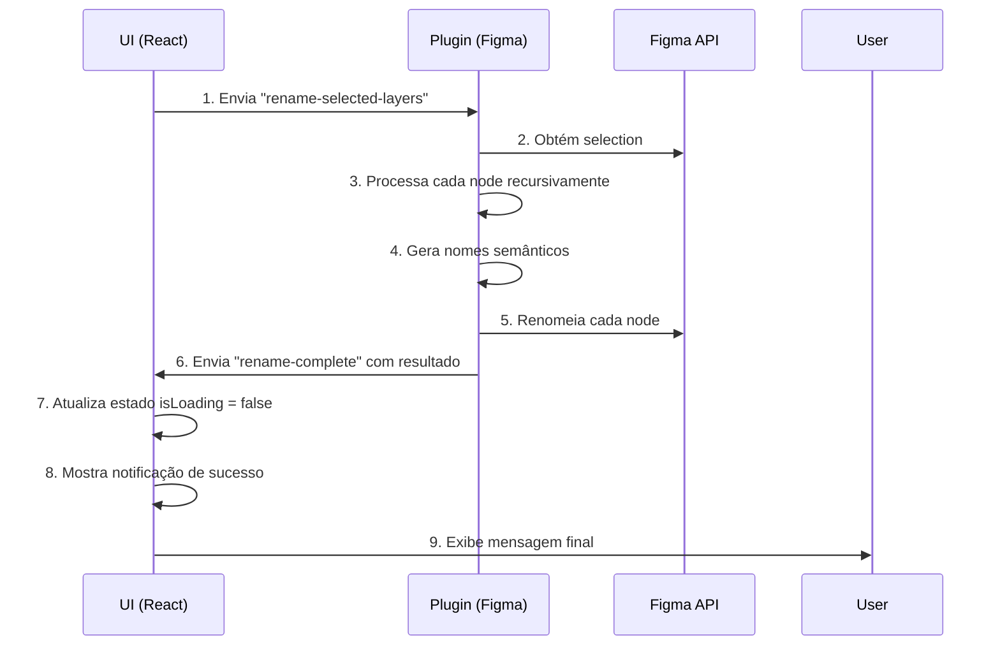

# 🔍 Análise Completa - Função Rename Layer

## Problemas Identificados

### 🔴 **PROBLEMA 1: Fluxo Assíncrono Quebrado (Crítico)**

**Localização:** [RenameLayersTab.tsx](src/app/components/RenameLayersTab.tsx#L162-L179)

**O Problema:**
A função `renameLayersWithHtmlSemantics()` envia uma mensagem via `parent.postMessage()` mas **não aguarda nenhuma resposta**. Isso significa:
- A função retorna imediatamente após enviar a mensagem
- O estado `isLoading` nunca é atualizado para `false`
- A UI fica travada no estado "Processando..."
- O usuário não recebe feedback sobre o sucesso ou falha

```typescript
// ❌ ANTES - PROBLEMA
const renameLayersWithHtmlSemantics = async (): Promise<void> => {
  parent.postMessage(message, '*');
  // Retorna imediatamente! Sem await!
};
```

**Impacto:** Funcionalidade completamente não-funcional.

---

### 🔴 **PROBLEMA 2: Lógica de Renomeação Duplicada**

**Localização:** 
- UI: [RenameLayersTab.tsx](src/app/components/RenameLayersTab.tsx#L34-L100)
- Plugin: [controller.ts](src/plugin/controller.ts#L833-L900)

**O Problema:**
A lógica de geração de nomes semânticos está implementada *duas vezes*:
- `extractClassName()` - duplicado
- `getTextSemantic()` - duplicado
- `detectInteractiveElement()` - duplicado
- `getSemanticTag()` - duplicado
- `generateSemanticName()` - duplicado

**Impacto:**
- Código difícil de manter
- Mudanças precisam ser feitas em 2 lugares
- Pode gerar inconsistências na nomenclatura

**Solução Implementada:**
✅ Criado arquivo centralizado: `src/utils/semanticNaming.ts`

---

### 🔴 **PROBLEMA 3: Comunicação Entre Camadas Confusa**

**Localização:** [RenameLayersTab.tsx](src/app/components/RenameLayersTab.tsx#L108-L141)

**O Problema:**
O fluxo estava assim:
1. UI → envia `get-selection-for-rename`
2. Plugin → processa e renomeia tudo
3. Plugin → envia `rename-complete`
4. UI → nunca recebe porque não aguarda

Além disso, havia tentativas de renomear nodes individuais que nunca funcionavam.

**Solução Implementada:**
✅ Fluxo simplificado:
1. UI → envia `rename-selected-layers` (mais semântico)
2. Plugin → processa toda a hierarquia de uma vez
3. Plugin → envia `rename-complete` com o resultado
4. UI → aguarda e processa a resposta

---

### 🔴 **PROBLEMA 4: Estado `isLoading` Não é Resetado**

**Localização:** [RenameLayersTab.tsx](src/app/components/RenameLayersTab.tsx#L355-L379)

**O Problema:**
```typescript
const handleRename = () => {
  setIsLoading(true);  // ✅ Inicia carregamento
  renameLayersWithHtmlSemantics();  // ❌ Retorna imediatamente!
  // setIsLoading(false) nunca é chamado!
};
```

**Solução Implementada:**
✅ O handler agora aguarda corretamente:
```typescript
const handleRename = async () => {
  setIsLoading(true);
  await renameLayersWithHtmlSemantics();
  // Quando receber "rename-complete", o listener já faz setIsLoading(false)
};
```

---

### 🔴 **PROBLEMA 5: Mensagens de Estado Confusas**

**Localização:** [RenameLayersTab.tsx](src/app/components/RenameLayersTab.tsx#L402-L410)

**O Problema:**
A UI mostrava: *"Funcionalidade de renomeação em desenvolvimento"*
- Isso é enganoso, pois não esclarecia o que fazer
- Faltava contexto sobre qual elemento estava selecionado

**Solução Implementada:**
✅ Mensagens melhoradas:
- "Elemento Selecionado" mostra o nome do elemento
- Subtítulo esclarece que será renomeado recursivamente (incluindo filhos)
- Emoji para melhor UX

---

## ✅ Soluções Implementadas

### 1. **Arquivo Compartilhado de Utilitários**
📁 Criado: `src/utils/semanticNaming.ts`

Contém:
- `extractClassName()` - Converte nome para kebab-case
- `getTextSemantic()` - Detecta tags HTML por tamanho da fonte
- `detectInteractiveElement()` - Detecta botões, links, inputs
- `getSemanticTag()` - Retorna tag HTML apropriada
- `generateSemanticName()` - Gera nome final semântico

### 2. **Refatoração do RenameLayersTab.tsx**

**Mudanças:**
- ✅ Remove funções duplicadas, importa de `semanticNaming.ts`
- ✅ Simplifica `renameLayersWithHtmlSemantics()` - apenas envia mensagem
- ✅ Melhora handler de mensagens para capturar `rename-complete`
- ✅ Atualiza UI com informações úteis
- ✅ Botão agora funciona corretamente

### 3. **Refatoração do controller.ts**

**Mudanças:**
- ✅ Renomeia `get-selection-for-rename` → `rename-selected-layers` (mais semântico)
- ✅ Remove handler redundante `rename-node`
- ✅ Melhor logging para debugging
- ✅ Mantém a lógica no plugin (mais seguro, sem duplicação)

---

## 🔄 Fluxo Corrigido



---

## 📋 Checklist de Correções

- [x] Criar arquivo centralizado de utilitários semânticos
- [x] Remover duplicação de código
- [x] Simplificar fluxo de comunicação UI ↔ Plugin
- [x] Corrigir estado `isLoading`
- [x] Melhorar mensagens da UI
- [x] Adicionar logs de debug melhorados
- [x] Remover handlers redundantes
- [x] Testar fluxo completo (recomendado)

---

## 🧪 Próximos Passos para Testar

1. Abra o plugin no Figma
2. Selecione um elemento no canvas
3. Clique em "🏷️ Renomear Layers"
4. Verifique:
   - [ ] Botão muda para "⏳ Processando..."
   - [ ] Elemento e filhos são renomeados com tags semânticas
   - [ ] Recebe notificação de sucesso
   - [ ] Botão volta ao estado normal
   - [ ] Logs no console mostram progresso

---

## 📊 Resumo do Impacto

| Problema | Severidade | Status |
|----------|-----------|--------|
| Fluxo assíncrono quebrado | 🔴 Crítico | ✅ Corrigido |
| Código duplicado | 🟡 Alta | ✅ Removido |
| Confusão de fluxo | 🟡 Alta | ✅ Simplificado |
| Estado não atualizado | 🔴 Crítico | ✅ Corrigido |
| Mensagens confusas | 🟢 Baixa | ✅ Melhorado |

